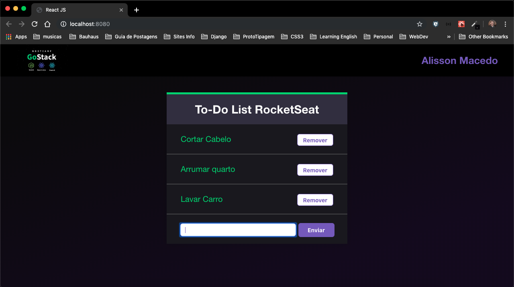

# [To-Do-List](https://github.com/AlissonMacedo/to-do-list-reactjs/)



## Static project to study and practice the flow of properties and states of components.

Application developed for module 04 of the GoStak bootcamp, promoted by [Rocketseat](http://www.rocketseat.com.br).

This project was modified from the last class, a new css
was created.

This is it a To do list for day to day


## How to use

```sh
npm install
```
```sh
npm start
```
The project will run in
```sh
http://localhost:8080/
```